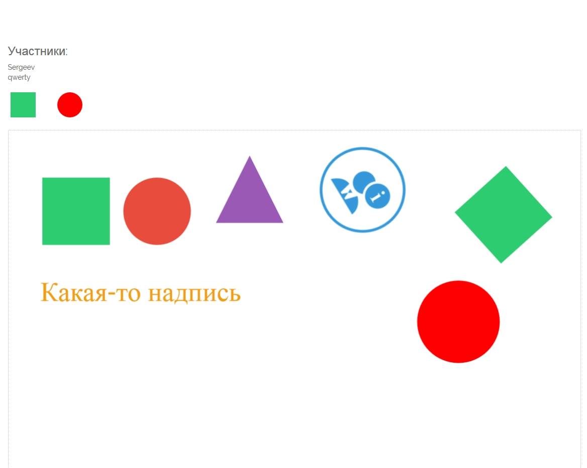

# NMCTraining

AngularJS + FabricJS + Socket.io + Express.



## Live Demo
Live Demo is hosted on Basfer

[Live Demo](http://bafser.ddns.net:8888/)

## How to use it

Clone this repository and run the following shell commands afterwards:

```shell
npm install
```

### Running the app

Run the following shell commands:

```shell
node server.js
```

## Contact

For more information on AngularJS please check out http://angularjs.org/
For more on FabricJS and Socket.io, http://fabricjs.com/ and http://socket.io/ are
your friends.

## License

MIT License

Copyright (c) 2019 Arilla0

Permission is hereby granted, free of charge, to any person obtaining a copy
of this software and associated documentation files (the "Software"), to deal
in the Software without restriction, including without limitation the rights
to use, copy, modify, merge, publish, distribute, sublicense, and/or sell
copies of the Software, and to permit persons to whom the Software is
furnished to do so, subject to the following conditions:

The above copyright notice and this permission notice shall be included in all
copies or substantial portions of the Software.

THE SOFTWARE IS PROVIDED "AS IS", WITHOUT WARRANTY OF ANY KIND, EXPRESS OR
IMPLIED, INCLUDING BUT NOT LIMITED TO THE WARRANTIES OF MERCHANTABILITY,
FITNESS FOR A PARTICULAR PURPOSE AND NONINFRINGEMENT. IN NO EVENT SHALL THE
AUTHORS OR COPYRIGHT HOLDERS BE LIABLE FOR ANY CLAIM, DAMAGES OR OTHER
LIABILITY, WHETHER IN AN ACTION OF CONTRACT, TORT OR OTHERWISE, ARISING FROM,
OUT OF OR IN CONNECTION WITH THE SOFTWARE OR THE USE OR OTHER DEALINGS IN THE
SOFTWARE.

